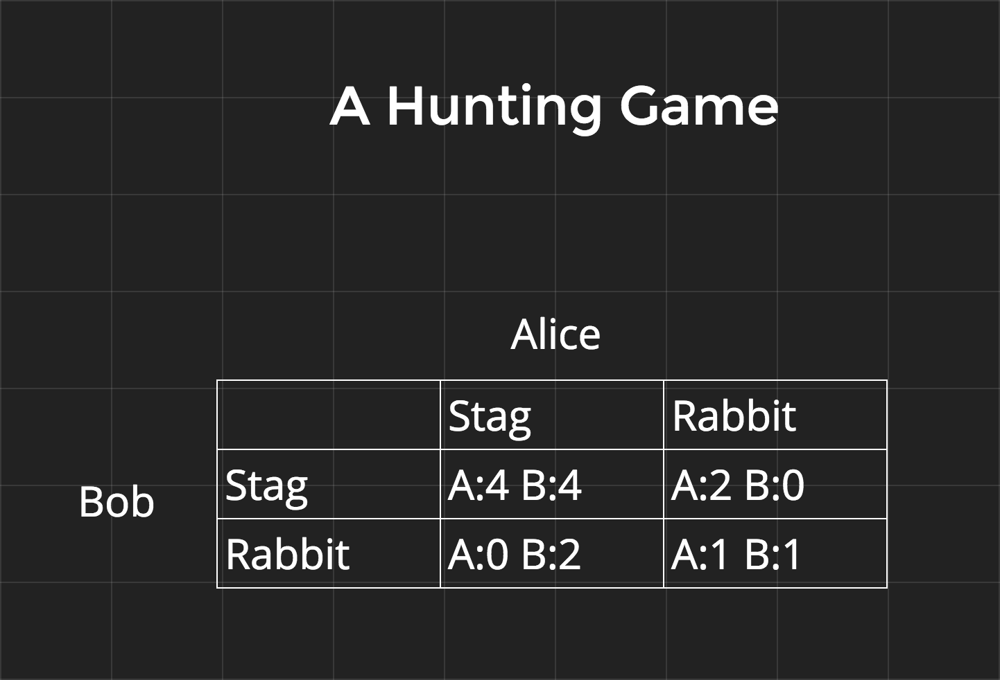
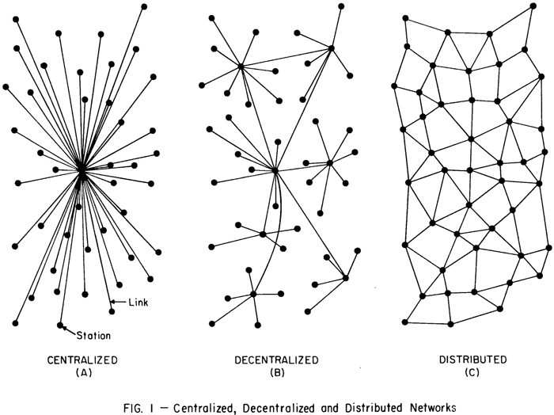

========================================
Cryptology Primer
========================================

Cryptocurrencies uniquely combine pieces of cryptography and game theory to create a distributed, decentralized peer to peer payment network.

Alice and Bob
=============
It's imperative when talking about crypto to use the correct naming for example people. At minimum the first two participants should be named Alice and Bob. Any attacker must be called Eve. From there continue from C down the alphabet. For example: Charlie, Dawn, Frank, Gilbert, Jill, etc.

Cryptographic Primitives and Data Structures
============================================
`Like every other field <https://www.xkcd.com/435/>`_ in existence, cryptography is just applied math. Expressing data as sequences of numbers allows for simple, yet powerful applications of mathmetical formulas to accomplish a wide range of goals.

Hash Functions
##############
A hash function maps an arbitrary amount of data to a value of fixed size. It's deterministic, the same key as input will always return the same value as output.

Example:
  A function *H* that takes characters, words, or sentences and returns the first character.

  - H(a) -> a
  - H(alphabet) -> a
  - H(The light at the end of the tunnel.) -> T

This isn't considered a "good" hash function, because if used in practice there will probably be many *collisions* where two keys map to the same value. A *perfect* hash function maps every key to a different value. Perfect hash functions don't exist unless the range of keys is constrained to a fixed number of possibilities.

An example of a non-perfect but still very good hash function is `SHA-3 <https://en.wikipedia.org/wiki/SHA-3#Design>`_. Multiple variants exist such as SHA3-256 and SHA3-512 which return 256 bit and 512 bit values respectively. Because hash function can have collisions, they also function as *one-way functions* because there is no way to retrieve the original keys from the value. At the same time 256 is enough bits of entropy that collisions are practically not worth considering, as there are an estimated :math:`2^{272}` atoms in the entire universe. 256 bits of entropy is also secure enough, and 512 bits is for sure enough, to deter attempts to brute force determine keys from the value.

Randomness
##########

It's hard to get a truly random number that can't be predicted over time. The strength of a random number lays in it's source of entropy, this can be: mouse movements, the temperature, air currents, the time, etc.

Hashing can be used to combine sources of entropy into a final psuedo-random number and obscure the origin of the sources of entropy.

Public-key Cryptography
=======================
This refers to any system that uses key pairs. The private key is kept secret and used by the holder to authenticate their identity. From the private key an infinite number of public keys can be derived. By design public keys can be shared freely without compromising the private key.

Signing
=======
Public-key cryptography can be used for authentication of a person's identity, *assuming that a person's private key hasn't been compromised.* The private key can be used to sign a document, and the signature can be verified with the public key.

`Appendix A`__ contains an example of a signing algorithm. For a challenge try implementing the given formulas in the programming language of your choice.

__ `A) Schnorr Signatures`_

Encryption
==========
Going further than just authentication, public-key cryptography can be used to encrypt a message so that only a select party can read it. Messages can be encrypted with a private key and decoded with a public key and vice versa.

`Appendix B`__ contains an example of an encryption algorithm. For a challenge try implementing the given formulas in the programming language of your choice.

__ `B) RSA`_

Diffie-Hellman Key Exchange
===========================

Using public-key cryptography, Alice and Bob can create a cryptographically secure channel and send encrypted messages to each other. They do this by generating a shared secret that only they know and then freely using this as a secret key in one of an infinite number of encryption schemes. Even if Eve is listening to Alice and Bob's messages she can't decrypt their communications.

A really bad, but working example encryption scheme using the secret key might be multiplying the message by the key to encrypt and dividing by the key to decrypt.

`Appendix C`__ contains the details of Diffie-Hellman. For a challenge try implementing the given formulas in the programming language of your choice.

__ `C) Diffie-Hellman Key Exchange`_

Merkel Trees
============
These are a type of trie data structure where every non leaf element contains a hash of its children. There are no other constraints on its formation. Bitcoin uses these in multiple ways, for example: the entire blockchain forms a Merkle Tree with each block linking to the block that came before it enforcing block chronology.

.. image:: _static/images/merkle-tree.png

Game Theory
===========

Nash Equilibrium
################
This is a set of actions in a non-cooperative game where every participant has nothing more to gain by choosing a different action. Even if the participants could telepathically see into the strategies of others. How this comes into play in Bitcoin will come up in the next section.

A Hunting Game
  Alice and Bob go out on a hunt. Each must individually choose to hunt a stag or hunt a rabbit before leaving home. Each player must choose an action without knowing the choice of the other. If an individual hunts a stag, they must have the cooperation of their partner in order to succeed. An individual can get a rabbit by themself, but a rabbit is worth less than a stag.

The first example gives the points diagram for this hunting game. In this configuration there are two Nash Equilibria at Stag:Stag and Rabbit:Rabbit.

In the second example the points have been psuedo-arbitrarily adjusted so that there is only one Nash Equilibrium.

.. image:: _static/images/nash-2.png

Decentralize all The Things
===========================
Here are three different type of networks to think about when discussing how blockchain based systems differ from those they replace.

Appendix
################

A) Schnorr Signatures
=====================
Schnorr Signatures are special because they are one of the simplest and efficient signature schemes to be proven secure.

| define:

  | public `generator <https://en.wikipedia.org/wiki/Multiplicative_group_of_integers_modulo_n#Generators>`_ :math:`G`
  | Alice's private_key: :math:`a`
  | Alice's public_key: :math:`A = G^a\; (mod\; G)`
  | random signing number: :math:`k`
  | generated signing key: :math:`r = G^k\; (mod\; G)`
  | a message: :math:`M`
  | concatenation symbol: :math:`||`

Note:
Remember that everything defined above, including the message can and must be expressed as a number.
|

Signing
  With these Alice can compute a signature: :math:`S`

.. math::
  E = H(r || M)

  S = k - E*a

|  Alice publishes (M, E, S)
|

**Verification**

.. math::

  r_v = G^S * A^E

  e_v = H(r_v || M)

| check that :math:`e_v = E`

**Proof**

.. math::

  r_v = G^S * A^E = G^{k - E*a} * G^{E*a} = G^k = r

  e_v = H(r_v || M) = H(r || M) = E

B) RSA
======
Named after it's creators, RSA is extremely widely used. Even though more efficient algorithms have since been discovered RSA is still useful as an encryption scheme that's relatively simple to teach.

| define:

  | two large primes: :math:`p, q`
  | the `totient function <https://en.wikipedia.org/wiki/Euler's_totient_function>`_: :math:`\Phi`
  | secret encryption key: :math:`e`
  | message: :math:`m`
  | decryption key: :math:`D`
  | encrypted message or "ciphertext": :math:`C`

Encryption
  Alice can then compute:

.. math::

  N = p*q

  \Phi(N) = \Phi(p)*\Phi(q) =(p-1)*(q-1)

  D = \frac{1}{e}\; (mod\;\, \Phi(N))

  C = m^e\; (mod\; N)

| Alice then publishes the :math:`(C, D, N)`

**Decryption**

.. math::

  m = C^D\; (mod\; N) = m^{e*D}\; (mod\; N) = m^1\; (mod\; N) = m

Proof
  This is harder to explain, but it is detailed on the RSA `Wikipedia Page <https://en.wikipedia.org/wiki/RSA_(cryptosystem)>`_.

C) Diffie-Hellman Key Exchange
==============================

| define:

  | public generator :math:`G`
  | Alice's private_key: :math:`a`
  | Alice's public_key: :math:`A = G^a\; (mod\; G)`
  | Bob's private_key: :math:`b`
  | Bob's public_key: :math:`B = G^b\; (mod\; G)`

Then Alice and bob can trade their public keys and independently construct a shared secret for encrypting their messages.

.. math::

  Alice:\; (a, B) -> B^a = G^{ab}\; (mod\; G)

  Bob:\; (b, A) -> A^b = G^{ab}\; (mod\; G)

Once they both have a shared secret that only they know there is an infinite number of ways they can use the secret to encrypt and decrypt messages to each other. The unsolved `Discreet Log Problem <https://en.wikipedia.org/wiki/Discrete_logarithm>`_ ensures that even though Eve learns the public keys :math:`G^a` and :math:`G^b` she cannot use these to compute :math:`G^{ab}` and decrypt messages.
